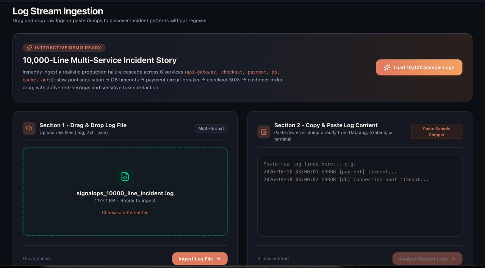
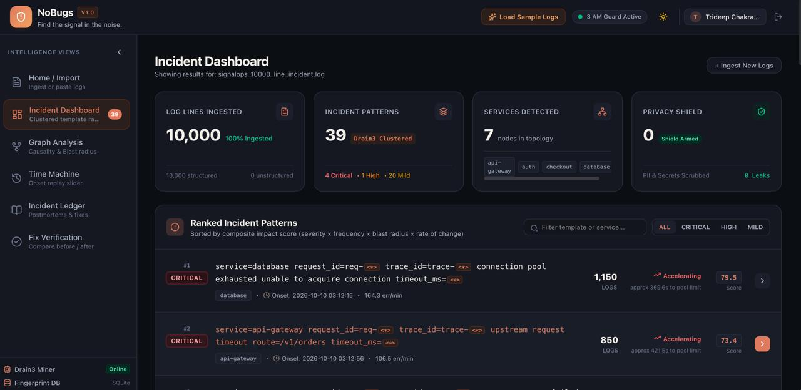
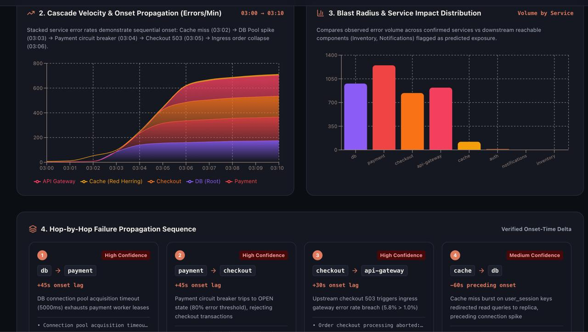
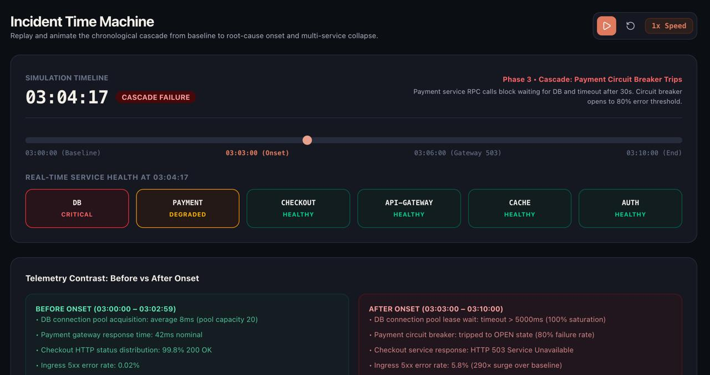
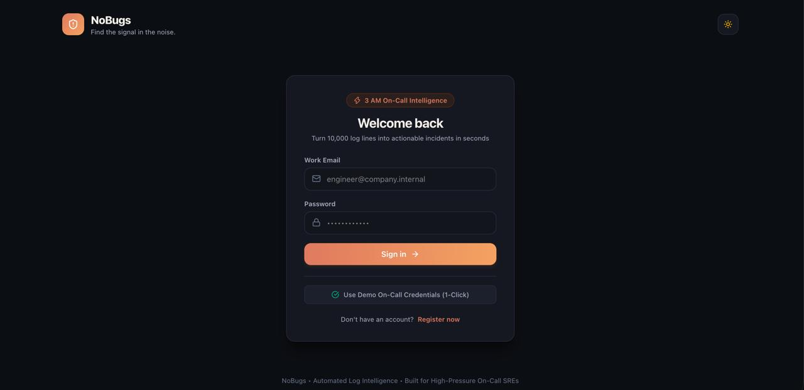

<div align="center">

# 🛡️ NoBugs

### Find the signal in the noise.
**Turn thousands of log lines into actionable incidents.**


[What We Built](#-what-we-built) · [Problem Statement](#-problem-statement) · [How to Run](#-how-to-run) · [Demo](#-demo) · [Features](#-features) · [Tech Stack](#-tech-stack) · [Limitations](#-current-limitations)

</div>

---

## 🛠️ What We Built

**NoBugs** is a web-based log analysis tool for developers and on-call engineers. You upload or paste raw logs, and NoBugs:

1. **Redacts** secrets and personal data (API keys, JWTs, passwords, emails, IPs, credit cards).
2. **Groups** thousands of log lines into a short list of incident patterns using Drain3 template mining.
3. **Ranks** those incidents as Critical, High, Mild, or Low, and shows whether each one is accelerating, flat, or decaying.
4. **Maps** how the failure spread across services (for example `db → payment → checkout → api-gateway`) with a blast radius graph.
5. **Explains** likely root causes with Claude, which gives competing hypotheses backed by log line citations (with an offline fallback if no API key is set).
6. **Verifies** a fix by comparing logs from before and after a patch.

In the bundled demo, **10,000 log lines across 7 services collapse into 39 incident patterns**, and the 4 critical ones tell the whole story of the outage.

## 🎯 Problem Statement

**Hackathon problem statement:** _<paste the exact problem statement title / number from the hackathon here>_

**The problem:** When production breaks, on-call engineers face thousands of repetitive log lines, many of them noise or red herrings. Finding which errors matter, which service failed first, and whether a fix worked takes valuable time, often at 3 AM under pressure.

**How NoBugs addresses it:** it turns raw logs into a small, ranked set of incidents, shows the order in which services failed, suggests root-cause hypotheses with evidence, and confirms whether a fix actually stopped the errors.

> **Goal:** Reduce the time needed to investigate large log files by turning repetitive logs into a short list of incidents an engineer can act on.

## 📸 Demo

**GitHub URL:**[ _add your repo link here_](https://nobugsproj.vercel.app/standalone/index.html) 

| Log Ingestion | Incident Dashboard |
|:---:|:---:|
|  |  |

| Graph Analysis & Blast Radius | Incident Time Machine |
|:---:|:---:|
|  |  |

<details>
<summary>Login screen</summary>



</details>

## ✨ Features

### 1. Log Ingestion & Privacy Shield
- **Dual ingestion:** drag-and-drop `.log`, `.txt`, or `.json` files, or paste raw logs straight from Datadog, Grafana, or a terminal.
- **Privacy Shield:** automatically redacts API keys, bearer tokens, JWTs, passwords, emails, IPs, and credit card numbers *before* analysis.
- **1-click 10k demo:** loads a realistic 10,000-line, multi-service cascade outage in under 0.5 seconds.
- **Drain3 template mining:** clusters thousands of log lines without hand-written regexes, turning variable values into `<*>`.

### 2. Incident Dashboard & AI Investigator
- **Impact-ranked priority:** clusters are ranked **Critical / High / Mild / Low** with a transparent score based on severity × frequency × blast radius × rate of change.
- **Trend & acceleration:** classifies each pattern as accelerating, flat, or decaying, and estimates time to saturation.
- **AI root-cause modal:** Claude generates 3 competing hypotheses, each with log line citations, contrary evidence, and a diagnostic test to tell them apart.
- **"Challenge This Theory":** asks the AI to look for evidence that contradicts the leading hypothesis.
- **1-click JSON export:** download incident patterns, priority scores, and sample lines as a report.

### 3. Graph Analysis & Blast Radius
- **Interactive causality network:** maps inferred upstream-to-downstream failure propagation (e.g. `db → payment → checkout → api-gateway`).
- **Blast radius toggle:** solid nodes are confirmed failures, dashed nodes are predicted downstream exposure.
- **Trace Failure:** highlights and animates the critical path from root onset to edge failure.
- **Edge detail inspector:** shows onset time lag, supporting log snippets, and a **High / Medium / Low** confidence badge.
- **Cascade velocity charts:** stacked area chart of errors per minute plus a per-service blast radius bar chart.
- **Early warning indicator:** flags leading signals (like connection acquisition latency) that appear before the major error spike.

### 4. Incident Time Machine
- **Chronological slider:** scrub back and forth across the incident.
- **Animated replay:** play events back at 1x, 2x, or 5x speed.
- **Live health grid:** per-service status pills switch between healthy, degraded, and critical based on timeline position.
- **Before vs. after contrast:** compare healthy baseline telemetry with post-onset metrics.

### 5. Incident Ledger & Fingerprint Matcher
- **Postmortem form:** record the problem statement, root cause, fix applied, and outcome.
- **Historical knowledge base:** a searchable ledger of past fixes so nobody solves the same outage twice.

### 6. Fix Verification
- **Before / after diff:** compare baseline incident logs with a post-patch log window.
- **Pattern status tracking:** each pattern is marked **Eliminated**, **Decreased**, **Persisted**, or **New Anomaly**.
- **Resolution verdict:** an automatic **RESOLVED / MITIGATED / REGRESSED** banner with exact percentage error reductions.

## 🧰 Tech Stack

**Frontend**

| Tool | Purpose |
|---|---|
| React + Vite | Fast, reactive UI |
| Tailwind CSS | Styling with dark and light themes |
| React Flow | Interactive causality and blast radius graphs |
| Recharts | Error velocity timelines and service impact charts |
| Lucide Icons | Iconography |

**Backend**

| Tool | Purpose |
|---|---|
| Python + FastAPI | High-performance REST API with async request handling |
| Drain3 | Log template mining (clusters 10K lines in under 0.5s) |
| SQLite + SQLAlchemy | Storage for users, log sessions, incident history, and the postmortem ledger |
| JWT & Bcrypt | Token-based authentication and password hashing |
| Claude API (Anthropic) | Root-cause hypotheses, contrary evidence, and diagnostic tests, with a built-in offline fallback |
| Privacy Shield | Redaction engine for secrets and PII before analysis |

## 🚀 How to Run

You can have NoBugs running locally in about 5 minutes. **No API key is needed**: without one, the app uses its built-in offline fallback for AI analysis, so every feature can still be judged.

### Prerequisites
- [Node.js](https://nodejs.org/) 18 or newer
- [Python](https://www.python.org/) 3.10 or newer
- Git

### Step 1: Clone the repository
```bash
git clone https://github.com/Trideep091/NoBugs.git
cd NoBugs
```

### Step 2: Start the backend (FastAPI)
```bash
cd backend
python -m venv venv
source venv/bin/activate          # Windows: venv\Scripts\activate
pip install -r requirements.txt
uvicorn main:app --reload --port 8000
```
The API will be available at `http://localhost:8000` (interactive docs at `http://localhost:8000/docs`).

### Step 3: Start the frontend (React + Vite)
Open a **second terminal**:
```bash
cd NoBugs/frontend
npm install
npm run dev
```
Open the URL Vite prints, usually `http://localhost:5173`.

### Step 4: Try it in under a minute
1. On the login screen, click **Use Demo On-Call Credentials (1-Click)**.
2. Click **Load 10,000 Sample Logs** (or upload / paste your own `.log`, `.txt`, or `.json` file).
3. Open **Incident Dashboard** to see the ranked incident patterns.
4. Open **Graph Analysis** to see the failure cascade and blast radius.
5. Open **Time Machine** and press play to replay the outage.
6. Open **Fix Verification** to compare before-fix and after-fix logs.

### Optional: enable live AI investigations
```bash
export ANTHROPIC_API_KEY=your_key_here     # Windows: set ANTHROPIC_API_KEY=your_key_here
```
Set this in the backend terminal before running `uvicorn`. Never commit your key to the repo.

### Troubleshooting
| Problem | Fix |
|---|---|
| `pip install` fails | Make sure the virtual environment is activated and Python is 3.10+ |
| Frontend loads but shows network errors | Confirm the backend is running on port 8000 and the frontend's API URL points to it |
| Port already in use | Run `uvicorn main:app --reload --port 8001` and update the frontend API URL to match |

> 📝 *The `backend/` and `frontend/` folder names, the `main:app` entry point, and port 8000 should be double-checked against the actual repo before submitting.*

## 🧪 QA Testing & Bug Resolution

NoBugs was tested across pages, APIs, and viewports to hold up under real on-call conditions.

### Test coverage
- **Integration tests:** end-to-end suite covering `/auth`, `/logs/ingest`, `/incidents`, `/ledger`, and `/verification` with 0 failures.
- **10,000-line benchmark:** clustering and ranking completed in **0.27s** with no memory leaks observed.
- **Edge cases:** empty uploads, whitespace-only input, invalid emails, missing postmortem fields, and 404 boundaries.
- **Responsive design:** tested at Desktop (1440px), Tablet (768px), and Mobile (375px) with a collapsing sidebar.
- **Production build:** `vite build` completes in ~200ms with no syntax, JSX, or bundling errors.

### Resolved bugs

| # | Bug | Severity | Root cause | Resolution | Status |
|---|---|---|---|---|:---:|
| 1 | Pydantic 422 React render crash | `CRITICAL` | FastAPI returns an array of error objects on invalid input; rendering it directly triggered React error #31. | Normalized error parsing in `client.js` to serialize nested details into readable strings. | ✅ Fixed |
| 2 | Incident Ledger form desync | `HIGH` | Postmortem form state did not update when opened from `IncidentModal` after initial mount. | Added a `useEffect` sync hook in `LedgerView.jsx` to prefill incident data. | ✅ Fixed |
| 3 | React Flow node overlap | `HIGH` | Multiple incidents on the same service shared the same coordinates (`y = 200`) and stacked on top of each other. | Added a per-service slot counter in `causality.py` that staggers vertical offsets (`slot * 135px`). | ✅ Fixed |
| 4 | Mobile layout squishing (< 768px) | `MEDIUM` | Sidebar stayed expanded at 256px on mobile, compressing cards to 119px. | Added viewport detection (`< 1024px`) to default the sidebar to icon mode. | ✅ Fixed |
| 5 | Unsafe serialization in stat cards | `MEDIUM` | Database array strings could cause a `TypeError` if undefined. | Added an `Array.isArray` fallback in `StatCards.jsx`. | ✅ Fixed |

## ⚠️ Current Limitations

- **Inferred root causes:** causality links and root-cause theories are inferences, not guaranteed facts.
- **Pattern mining, not deep learning:** error grouping relies on Drain3 template mining rather than a custom-trained model.
- **Timestamps required:** accurate timeline replay and cascade ordering need parseable timestamps.
- **Multiline traces:** deeply nested multiline stack traces are currently parsed line by line.
- **Symptom-level verification:** Fix Verification confirms errors stopped appearing, not that the code is bug-free.
- **AI cloud dependency:** live AI investigations need an Anthropic API key; without one the app uses offline fallback rules.

## 🔮 Future Improvements

- Deeper AI-powered root-cause investigation with supporting log evidence
- Richer service dependency and blast radius visualization
- Improved structured log parsing, including multiline stack traces
- More advanced anomaly detection
- Recommended diagnostic steps
- Smarter historical incident memory

## 👥 Team

Built by the **NoBugs Team** for _<hackathon name>_.

<!-- Add team member names and links here -->

## 📄 License

This project is licensed under the **MIT License**. See the [LICENSE](LICENSE) file for details.

```
Copyright (c) 2026 NoBugs Team
```
